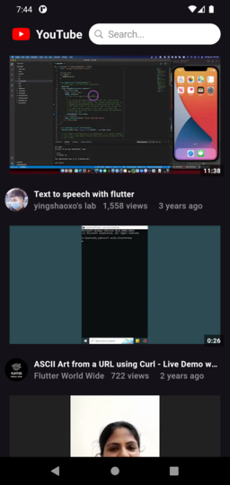
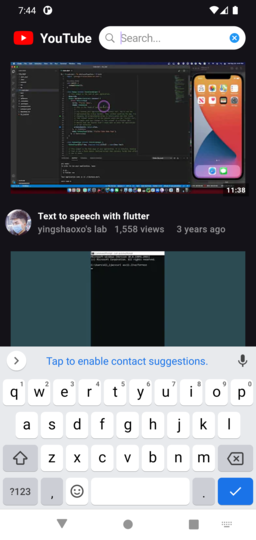

# 📺 YouTube Profile Viewer App

A Flutter mobile application that allows users to search and view data from YouTube channels in real-time using a YouTube API. The app fetches and displays channel details such as name, profile picture, subscriber count, and recent videos using RESTful APIs.

## 🚀 Features

- 🔍 Search for any public YouTube channel by username or ID
- 📄 View detailed channel info:
  - Channel Name
  - Profile Picture
  - Subscriber Count
  - Number of Videos
  - Channel Description
- 🎞️ Display a list of recent videos with thumbnails and view counts
- 📡 Real-time data fetching using API
- ✨ Clean and responsive UI with modern layout

## 🛠️ Technologies Used

- [Flutter](https://flutter.dev/)
- Dart
- [YouTube Data API](https://developers.google.com/youtube/registering_an_application) or [RapidAPI - YouTube API](https://rapidapi.com/)
- RESTful API Integration
- JSON Parsing
- Responsive UI Design

## Screenshots





## 📁 Project Structure

```bash
lib/
├── main.dart                    # Entry point
├── services/
│   └── api_service.dart         # API handling (fetch channel/videos)
├── models/
│   ├── channel_model.dart       # Channel model
│   └── video_model.dart         # Video model
├── pages/
│   ├── home_page.dart           # Search UI
│   └── channel_page.dart        # Channel details and video list
├── widgets/
│   ├── video_tile.dart          # UI for a single video
│   └── channel_header.dart      # UI for top channel info
```
